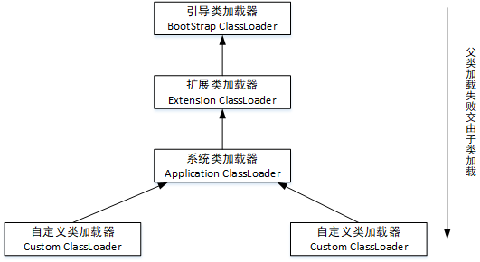
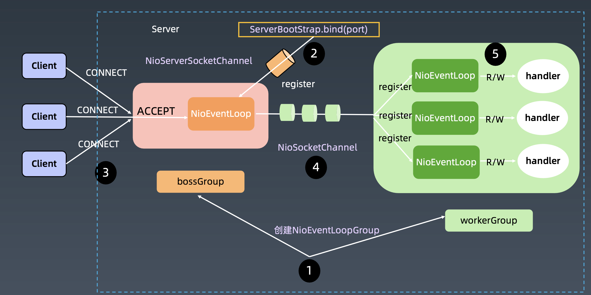
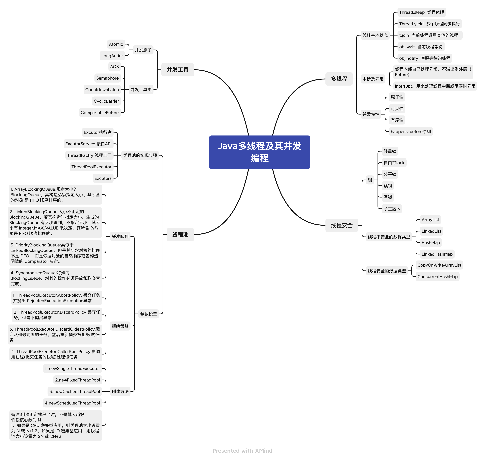
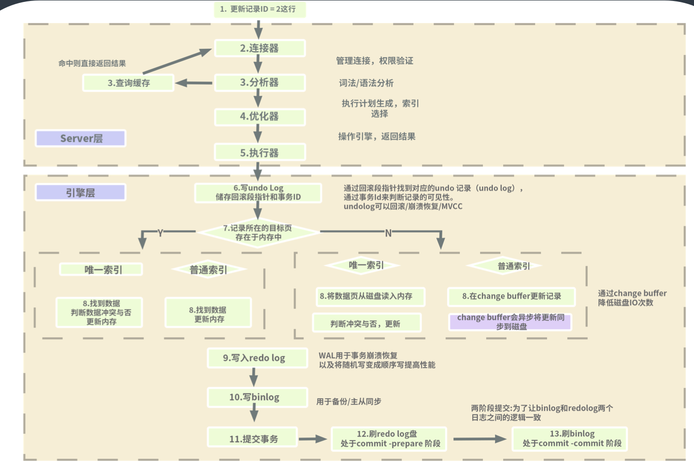
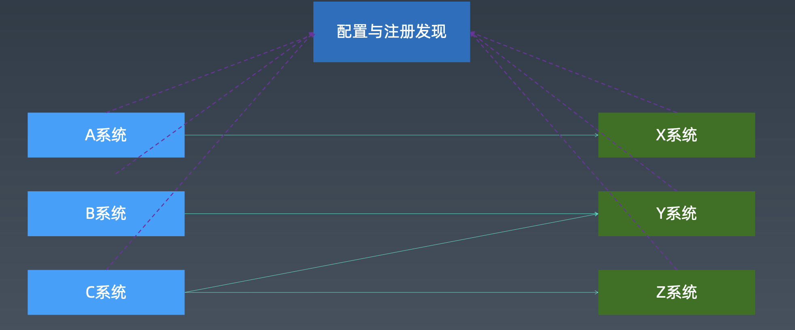
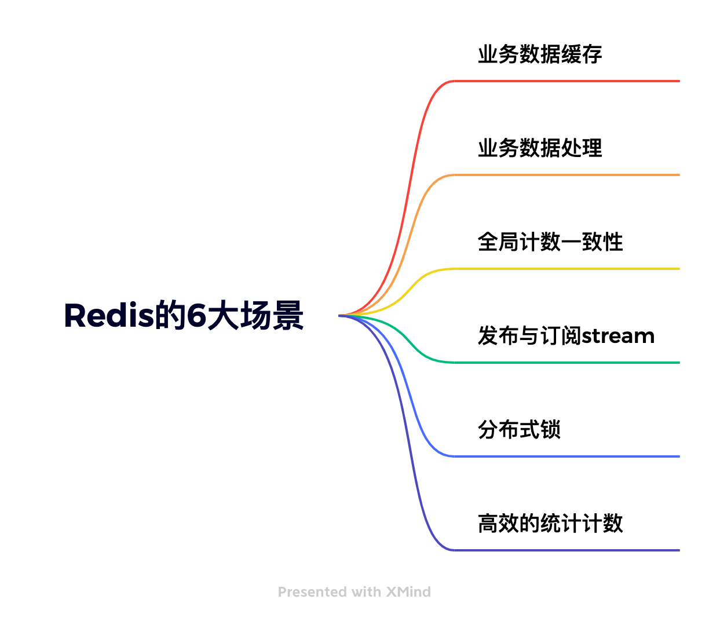
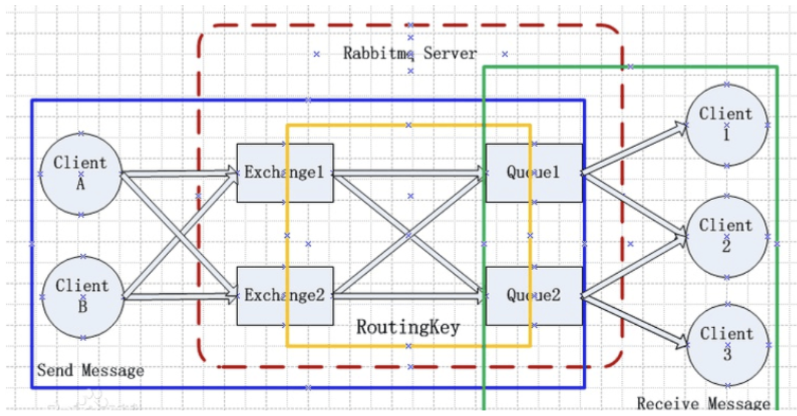

# JVM

JVM是Java运行的基础，通过秦老师的课程我了解了JVM的组成原理是怎么样的以及它的生命周期的组成；再通过深入的学习后我又逐渐的知道了在JVM内部中，我们最关心的就是Java的垃圾回收，共有3种GC的回收算法，通过这些垃圾回收机制的合理调配，可以大幅度的提高Java的运行效率。

# NIO

Java NIO中的Buffer用于和NIO通道进行交互，**是将数据移进移出通道的唯一方式**，通过对NIO的学习，我学会了如何使用网络编程以及简单的缓存技术，以提高代码的效率，尤其是Netty这块，通过Netty可以大大的提高我们服务器的吞吐量，让服务器响应更快，使得其更加稳定。

# 并发编程

通过对并发编程的学习，我了解到了Java中多线程的基本知识，例如线程的基本状态、中断及异常等等，以及线程安全等问题，通过对线程安全安全问题的深入分析，我知道了线程中的锁的概念轻量锁、自由锁、读写锁等等，以及线程中不安全的数据类型，例如Array List、`LinkedList`等等

# Spring和ORM等框架

spring是现在的Java开发中使用的最多也是最广泛的框架，通过Spring的框架，大大的提高了了我们编写代码的效率，在课堂中，我学到了Spring的生命周期以及SpringBoot和SpringCloud的基本配置和其其本原理，让我对Spring的基础有了更深一层的理解。

# MySQL数据库和SQL

MySQL是我们在开发中最常用到的一个关系型数据库，通过课程的学习，我对SQL的执行流程有了一个清晰的认知，同时也帮助我在平时的工作中提高了SQL的编写能力。尤其是在关于MySQL的分布式数据库中对我在工作中的启发很大，通过这个设计帮助我解决了我们组内的数据库难题。

# 分库分表

数据库分库分表的设计可以提高我们对数据查询效率以及数据的存储容量。数据库的拆分又分为垂直拆分和水平拆分：垂直拆分的优点：便于我们对数据库进行维护和管理同时对性能和容量都有提高；水平拆分的优点：可以提高数据库的性能并相对于垂直拆分来说，影响更小。

# RPC 和微服务

通过对RPC的学习，我清楚的了解到RPC框架可以说是微服务的前身，通过使用微服务的架构，将我们由原来的代理调用，响应速度慢的方式改为了直连调用，大大的提升了服务的响应速度

# 分布式缓存

通过分布式缓存的学习，我知道了redis使用的六大场景：1.业务数据缓存。2.业务数据处理。3.全局计数一致性。4高效的统计计数

5.发布订阅与`stream`。6.分布式锁。通过这6大场景可以对我现在负责的系统有特别大的优化处理

# 分布式消息队列

在分布式消息队列中，通过对`topic`,`broker`等概念的学习，我对消息队列这一个中间件有了一个清楚地认知，并在我现在所负责的工作中已经开始使用了消息中间件，它极大的减少了当前系统与其他系统的耦合，解决了系统与系统间通信通信的问题

